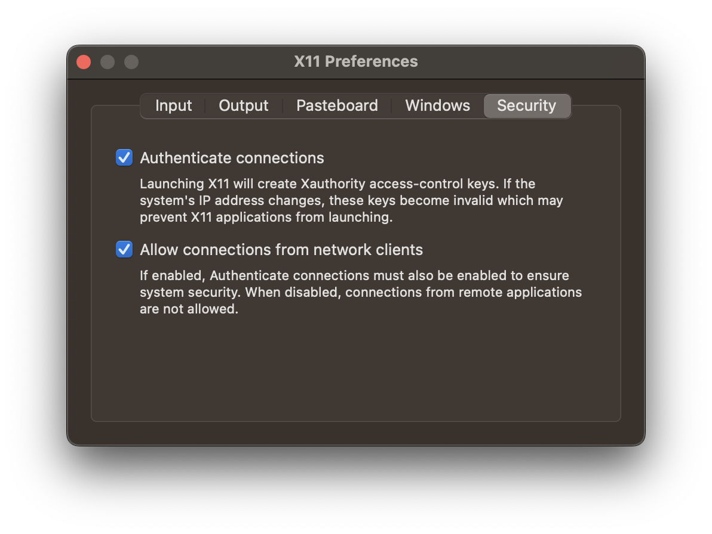
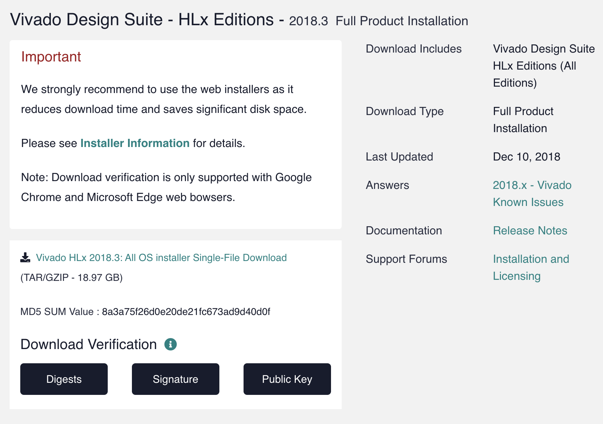
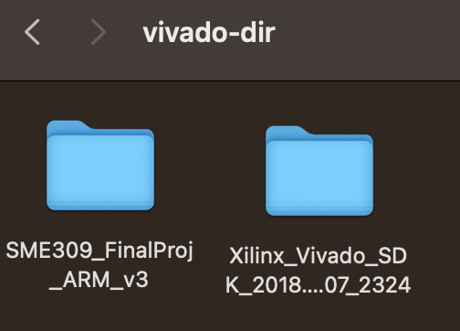
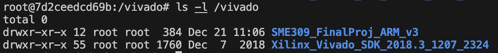

<!-- Improved compatibility of back to top link: See: https://github.com/othneildrew/Best-README-Template/pull/73 -->

<br />
<div align="center">
  <h3 align="center">Running Vivado 2018.3 on Mac M1 CPU</h3>

  <p align="center">
    Haihan Wu
</div>

<details>
  <summary>Table of Contents</summary>
  <ol>
    <li>
      <a href="#about-the-project">About The Project</a>
      <ul>
        <li><a href="#built-with">Built With</a></li>
      </ul>
    </li>
    <li>
      <a href="#getting-started">Getting Started</a>
      <ul>
        <li><a href="#brew">Homebrew</a></li>
        <li><a href="#xquartz">xquartz</a></li>
	<li><a href="#vivado-packages">Vivado Packages</a></li>
	<li><a href="#Docker">Docker</a></li>
      </ul>
    </li>
    <li><a href="#Installing-Vivado-in-Dockers">Installing Vivado on Mac</a></li>
    <li><a href="#Communication-between-Dockers-and-Mac">Communication between Dockers and Mac</a></li>
  </ol>
</details> 


## About The Project

The project is dedicated to running Xilinx Vivado on macbooks with M1/M2 processors. The docker container could provide a separate ubuntu operating systems on macos without taking up too much memory usage.

### Built With

This requires a variety of programs to run successfully. Care should be taken to ensure the correct versions of each piece of software are used, otherwise you WILL have compatibility issues

* Brew
* Docker Container (latest)
* Xilinx Vivado (2018.3)
* Xquartz

## Getting Started

### Homebrew

Open your terminal on your macbook and type

```
/bin/bash -c "$(curl -fsSL https://raw.githubusercontent.com/Homebrew/install/HEAD/install.sh)"
```

Brew is a powerful tool to install various packages. More information could be found on [https://brew.sh/](https://brew.sh/).

### Xquartz

Xquartz is used to display. Install it by

```
brew install --cask xquartz
```

After that, reboot your computer. Open `settings/security`, and make sure to click the box of "Allow connections from network clients", or you might not be able to launch GUI to install or use Vivado.



### Vivado Package

First download the 2018.3 packages from [https://www.xilinx.com/support/download/index.html/content/xilinx/en/downloadNav/vivado-design-tools/archive.html#:~:text=Edge%20web%20bowsers.-,Vivado%20HLx%202018.3%3A%20All%20OS%20installer%20Single%2DFile%20Download,-Vivado%20HLx%202018.3](https://www.xilinx.com/support/download/index.html/content/xilinx/en/downloadNav/vivado-design-tools/archive.html#:~:text=Edge%20web%20bowsers.-,Vivado%20HLx%202018.3%3A%20All%20OS%20installer%20Single%2DFile%20Download,-Vivado%20HLx%202018.3%E2%80%B8) (TAR/GZIP - 18.97 GB).



Create a repository then and put your downloaded package `Xilinx_Vivado_SDK_2018.3_1207_2324.tar.gz` into it by

```
cd ~
mkdir vivado-dir
mv ~/Downloads/Xilinx_Vivado_SDK_2018.3_1207_2324.tar ~/vivado-dir/
cd vivado-dir
tar -zxvf ./Xilinx_Vivado_SDK_2018.3_1207_2324.tar
rm -rf ./Xilinx_Vivado_SDK_2018.3_1207_2324.tar
```

### Docker

For compatibility reasons, it is more convenient to run everything in a docker container. Start by ensuring that docker is installed on your system with brew

```
brew install --cask docker
```

The docker container desktop could be easier for users without any experience in Linux systems and teminal commands. The desktop could be downloaded from [https://www.docker.com/products/docker-desktop/](https://www.docker.com/products/docker-desktop/%E2%80%B8).

After installing the docker, pull the ubuntu image in your dockers.

```
brew install --cask docker
```

We can start a container all in one go with the following command

```
docker run --name vivado --platform linux/amd64  
	-v ~/vivado-dir:/vivado 
	-v /dev:/dev 
	-v /tmp/.X11-unix:/tmp/.X11-unix:rw  
	-v ~/.Xauthority:/root/.Xauthority 
	-e DISPLAY=docker.for.mac.host.internal:0 
	-i -t ubuntu /bin/bash
```

The -v could setup a shared repository between your mac and the dockers. If succesfull, you should get a bash shell which you should then exit with the 'exit' command. Any time you want to access your container, you must first start it with:

```
xhost +
docker start vivado
```

Command `xhost +` allows the docker to activate the display, otherwise, you can run the vivado but no GUI renders. After that, you can then access a shell with

```
docker exec -it vivado bash
```

If you use VS Code, you can access your container with the Remote: Containers extension, which is recommended.

Moving forward, vivado will be installed inside of the container. First, we will download some dependencies. Start by opening a fresh shell in your container and running the following commands:

```
apt update
apt -y --no-install-recommends install ca-certificates curl sudo xorg dbus dbus-x11 ubuntu-gnome-default-settings gtk2-engines lxappearance gcc gedit
```

To test your display setup, type `gedit`. If a window pops up, then you are ready to install Vivado.

## Installing Vivado in Dockers

Now go to the package repository, and run "xsetup" tool scripts by

```
cd /vivado/Xilinx_Vivado_SDK_2018.3_1207_2324 
./xsetup
```

The vivado installing window will pop up, after following the instructions, your vivado is ready to use!

To activate vivado, we add the "vivado" to the environment variables. First we type to open your shell's .rc file `.bashrc` files

```
gedit ~/.bashrc
```

and add the following statement.

```
export PATH=$PATH:/tools/Xilinx/Vivado/2018.3/bin
```

Now, you can start your vivado by command `vivado` and the terminal output should look like this:

```
****** Vivado v2018.3 (64-bit)
  **** SW Build 2405991 on Thu Dec  6 23:36:41 MST 2018
  **** IP Build 2404404 on Fri Dec  7 01:43:56 MST 2018
    ** Copyright 1986-2018 Xilinx, Inc. All Rights Reserved.

start_gui
```

## Communication between dockers and MacOS

The repository that you have specified by command `-v` could be access by both MacOS and dockers. For example, we have mounted two repositories by command `-v ~/vivado-dir:/vivado`, `~/vivado-dir` on your mac and `/vivado` in your docker container. 

For example, if I placed some .v files in `~/vivado-dir`, then I can access and make changes on these files from both mac and dockers. It's convenient to use VSCode to modify your HDL codes on your Mac side, and use those files to run simulation and synthesis in your docker.




